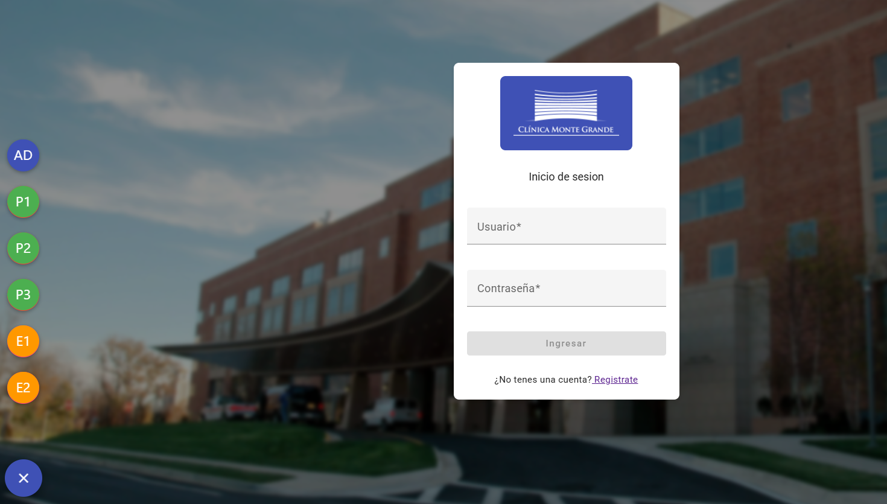
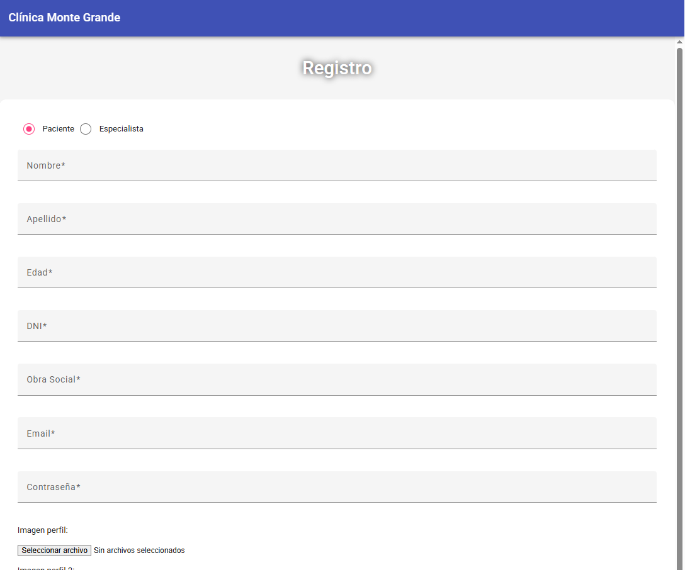
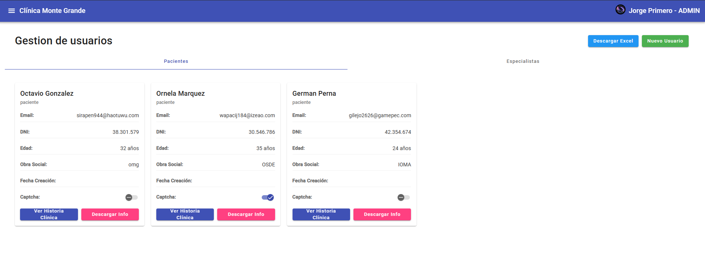
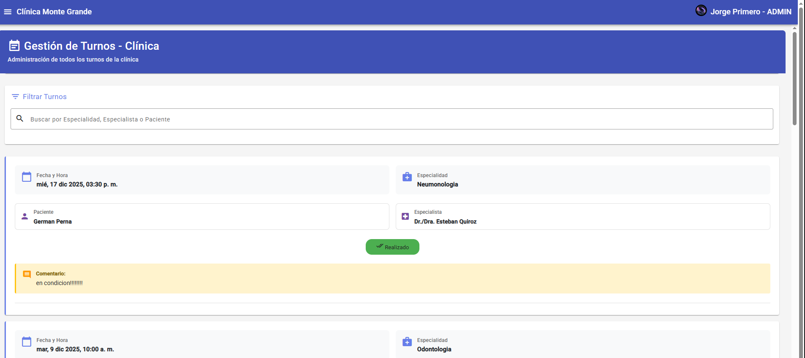
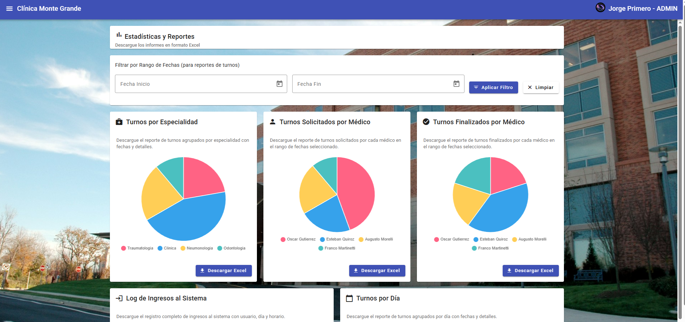
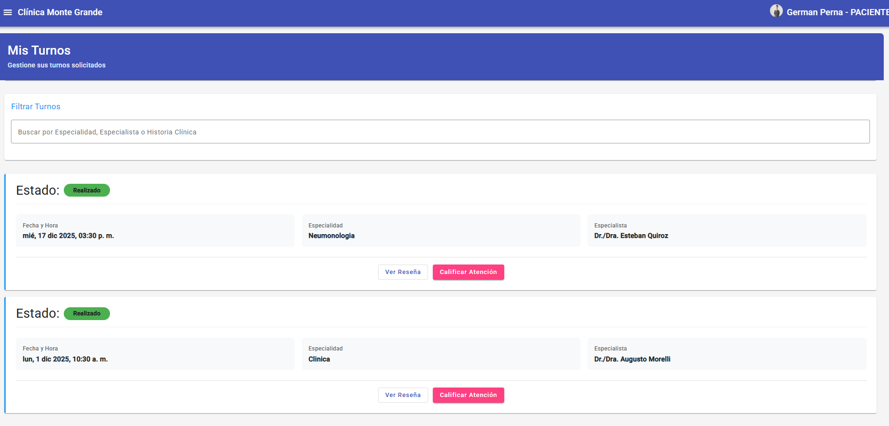
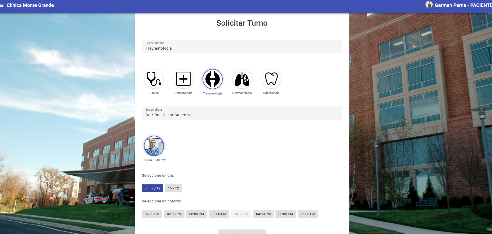
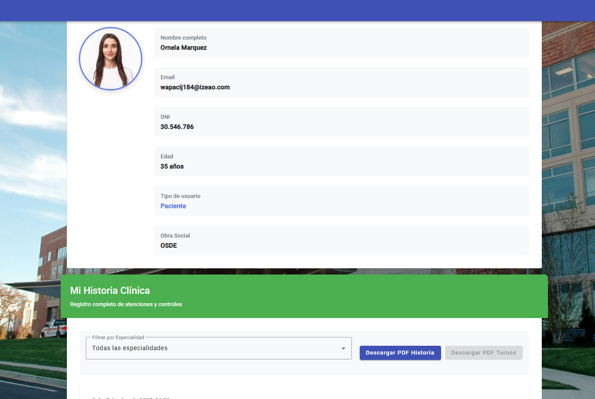
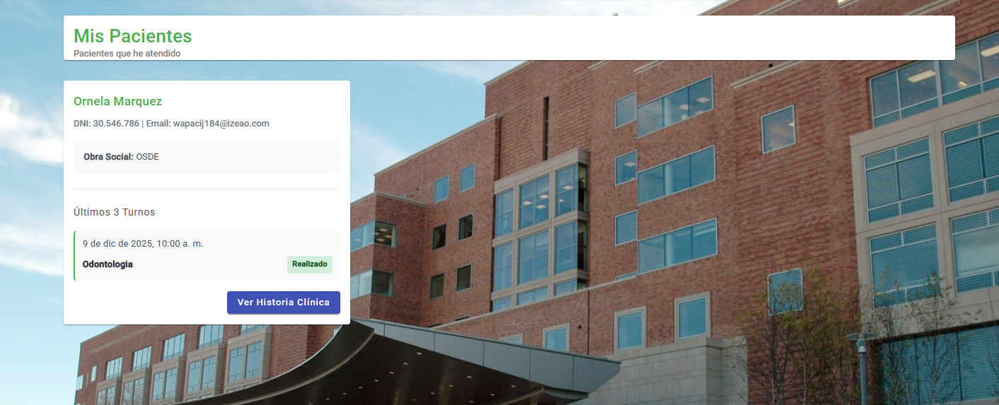

# Clínica App - Sistema de Gestión de Turnos Médicos

## Descripción del Sistema

Aplicación web para la gestión de turnos médicos en una clínica, que permite a pacientes solicitar turnos, a especialistas gestionar sus horarios y finalizar consultas, y a administradores supervisar el sistema completo.

## Páginas Principales

### Home
Página de inicio del sistema que muestra información general y opciones de navegación según el tipo de usuario autenticado.

### Login
Página de autenticación donde los usuarios ingresan con sus credenciales para acceder al sistema.

### Registro
Formulario de registro para nuevos usuarios, permitiendo crear cuentas como paciente o especialista con validación de datos.

### Usuarios
Panel de administración para gestionar todos los usuarios del sistema, habilitar o deshabilitar cuentas y configurar permisos.

### Turnos
Vista administrativa para supervisar todos los turnos del sistema, con opciones para cancelar o modificar turnos existentes.

### Estadísticas
Panel de reportes y estadísticas con gráficos interactivos y exportación a Excel de datos de turnos, especialidades y logs de ingresos.

### Mis Turnos
Vista personalizada donde cada usuario puede ver sus turnos asignados, con opciones para cancelar, calificar o completar según el rol.

### Solicitar Turno
Formulario para que los pacientes soliciten nuevos turnos, seleccionando especialidad, especialista y horario disponible.

### Mi Perfil
Página de perfil personal donde los usuarios pueden ver y editar su información, y los especialistas pueden configurar sus horarios de atención.

### Pacientes
Vista exclusiva para especialistas que muestra la lista de sus pacientes y permite acceder al historial clínico de cada uno.

